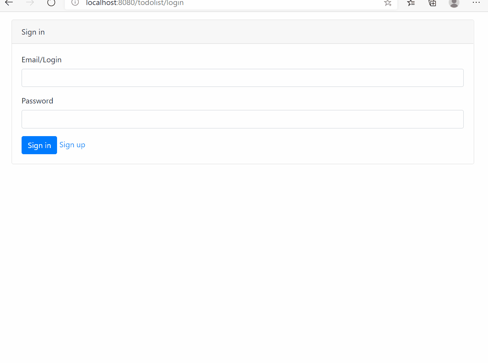
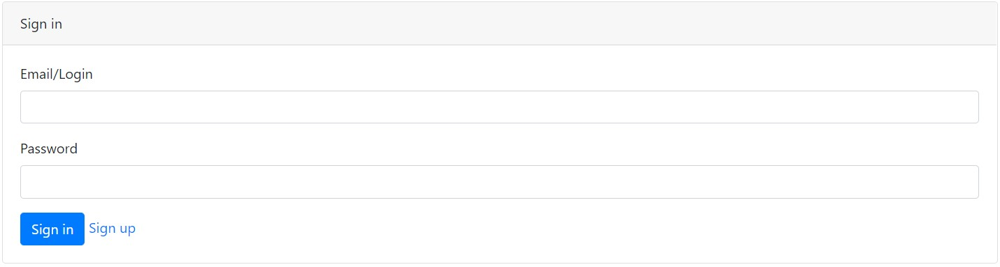
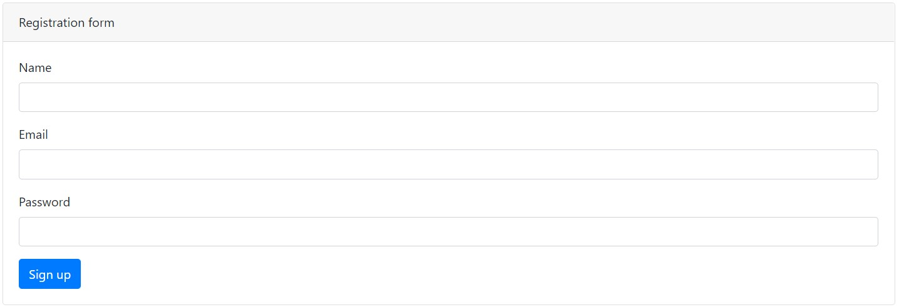
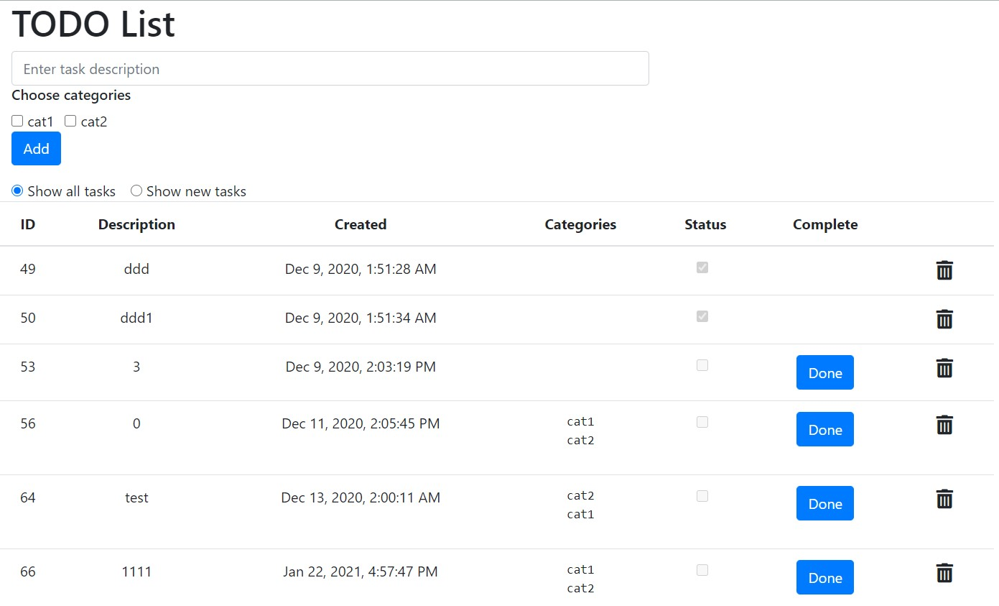
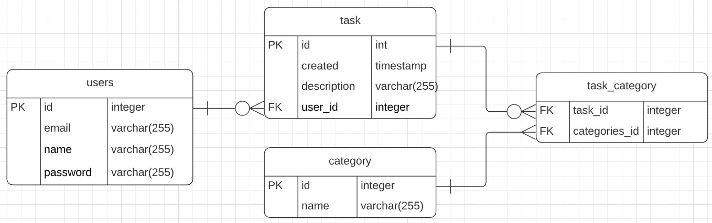

## TODO List
[](https://travis-ci.com/denisRudie/to-do-list)
### О проекте
Сервис todo list. Основан на сервлетах + hibernate
. Позволяет пользователям вести список заданий. Задания сохраняются в БД. Клиент с контроллером обмениваются сообщениями в формате JSON.
### Technologies
* Java 14
* Java EE Servlets
* Apache Tomcat
* Hibernate, Postgres
* JS, AJAX, HTML5, Bootstrap (front)
* Gson, json-simple for parsing JSONs
* Maven as a build system
* Travis CI
### Возможности
* Авторизация/регистрация. Доступ только у авторизованных пользователей (реализовано через фильтр). Авторизованный пользователь сохраняется в сессию.
* Добавление заданий в список. Для каждого задания могут быть выбраны категории. У каждого пользователя свой список заданий.
* Удаление заданий из списка.
* Отметка о завершении задания.
* Фильтр для отображения в списке только новых (невыполненных) заданий.
### Demo
Working demo


Login page


Sign Up page


Main page


Data base schema

### REST API
для всех пользователей:

| команда              | запрос                                                                           | ответ                                              
|----------------------|----------------------------------------------------------------------------------|-------------------------|
| авторизация         | POST ```https://sitename/login```  Body: ```{action: "login", email: "John" , pwd: "123"}``` | Код состояния:```200 OR 401``` |
| регистрация         | POST ```https://sitename/login```  Body: ```{action: "new", name: "DENIS", email: "123@mail.ru", pwd: "123"}``` | Код состояния:```200``` |

для авторизированного пользователя:

| команда                                 | запрос                                                                | ответ                                              |
|-----------------------------------------|-----------------------------------------------------------------------|----------------------------------------------------|
| получить список категорий | GET ```https://sitename/todo?action=categories```                                       | Код состояния:```200``` Header: ```"Content-Type: application/json"```  Body: ```[{"id":1,"name":"cat1"}]``` |
| получить список всех заданий | GET ```https://sitename/todo?action=all```                                       | Код состояния:```200``` Header: ```"Content-Type: application/json"```  Body: ```[{"id":49,"description":"","created":"","status":true,"owner":{"id":1},"categories":[{"id":1}]}]``` |
| получить список новых заданий | GET ```https://sitename/todo?action=new```                                       | Код состояния:```200``` Header: ```"Content-Type: application/json"```  Body: ```[{"id":49,"description":"","created":"","status":true,"owner":{"id":1},"categories":[{"id":1}]}]``` |
| создать новое задание | POST ```https://sitename/todo```  Body: ```{action: "add", desc: "test", categories: [{id: "1"}]}```                                       | Код состояния:```200``` Header: ```"Content-Type: application/json"```  Body: ```[{"id":49,"description":"test","created":"","status":true,"owner":{"id":1},"categories":[{"id":1}]}]``` |
| отметить задание как выполненное | POST ```https://sitename/todo```  Body: ```{action: "update", id: "53"}```                                       | Код состояния:```200``` |
| удалить задание | POST ```https://sitename/todo```  Body: ```{action: "delete", id: "53"}```                                       | Код состояния:```200``` |
